# Surf the Wave

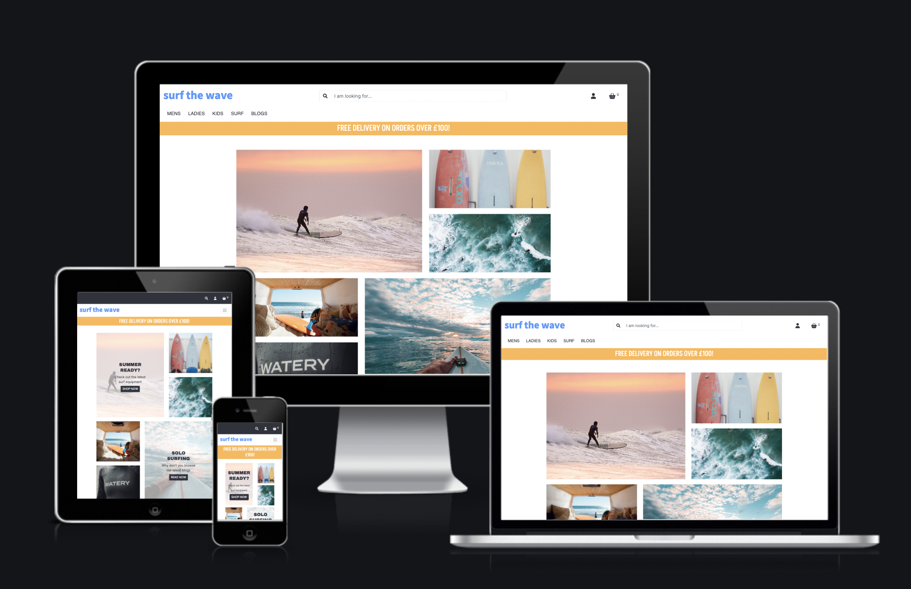

Surf the Wave is a fictional e-commerce site that sells surf equipment and surfwear for all those who love surfing or are curious to try! This is the fourth milestone project as part of my Diploma with Code Institute. This project focuses on the development of a full-stack e-commerce site that uses a centrally-owned dataset by using HTML, CSS, JavaScript, Python+Django, relational database(Postgres), stripe payments and AWS.

Deployed website can be viewed [here](https://surf-the-wave.herokuapp.com/).

## Table of Contents
---
1. [Project Goals]()
2. [UX]()
3. [Strategy Plane]()
    * [User Stories]()
4. [Scope Plane]()
    * [Existing Features]()
    * [Features Left to Implement]()
5. [Structure Plane]()
6. [Skeleton Plane]()
7. [Surface Plane]()
8. [Technologies]()
9. [Testing]()
10. [Deployment]()
11. [Credits]()
12. [Acknowledgements]()

---

## UX Design

## Strategy Plane

### Site Owner Goals
- Promote surf shop buisness and increase sales of surf boards and equipment
- Increase online status and promote the site on social media
- Encourage the uptake of surfing, amongst all ages and genders, through blog posts and social media

### Demograghic
- All genders and ethnicities
- All levels of surfing
- Ages 7+

### User Stories

- As a first time visitor:
    * I want to easily navigate throughout the site.
    * I want to understand the purpose of the site easily.
    * I expect an attractive site that contributes to my good experience.
    * I want the site to be accessible.
    * I want the site to be responsive across all devices.

- As an unregistered visitor:
    * I want to be able to search and filter products easily and efficiently.
    * I want to be able to sort and view products according to type, price and name.
    * I want to be able to be able to view product detail so I can find information about price, size and description.
    * I want to be able to add products to my shopping basket.
    * I want to be able to view my shopping basket.
    * I want to be able to edit my shopping basket.
    * I want to be able to view the total cost of my basket.
    * I want to be able to complete the checkout process and be able to enter payment information easily.
    * I want to be able to view a confirmation of my order once the checkout process is complete.
    * I want to be able to received an email confirmation of my order.
    * I want to be able to register easily for an account.
    * I want to be able to access the blog posts.

- As a registered visitor:
    * I want to be able to receive a confirmation email upon registration.
    * I want to be able to view my personalised profile.
    * I want to be able to save and edit personal information on my profile.
    * I want to be able to view my order history.
    * I want to be able to login an logout with ease.
    * I want to be able to leave reviews on products.
    * I want to be able to edit or delete my reviews.
    * I want to be able to leave comments on the blog posts.
    * I want to be able to edit or delete comments on blog posts.
    * I want to be able to delete my account.
    * I want to be able to change my password to keep my account secure.
    * I want to be able to reset my password if I forget it.

- As a returning visitor:
    * I want to be able to find social media links.
    * I want to be able to contact the site owner if I have any queries.
    * I want to enjoy using the site without never ending scrolling.

- As a superuser:
    * I want to be able to add new products.
    * I want to be able to edit or delete existing products.
    * I want to be able to add new categories.
    * I want to be able to add new blog posts.
    * I want to be able to edit or delete existing blog posts.
    * I want to be able to delete blog comments left by users. 
    * I want to be able to delete user reviews left on products.
    * I want to be able to access the Django admin portal easily
    * I want to be able to delete a user.
    * I want to be able to make another user admin.
    * I want to be notified when a user fills out the contact form, so I don't have to check the admin portal constantly.

## Scope Plane

### **Existing Features**

During the initial strategy planning, the opportunities of the site were determined and values were given according to their imporance and viability ranking between 1 and 5. Below are the list of features that were valued important and viable at this stage. The remaining features have been recorded in Features Left to Implement.

#### Design
- Responsive design
- Easy navigation throughout, nav links clearly labelled or icons used in navbar. Sidenav used for smaller devices.
- Site logo - returns user to the home page
- Nav link options will change depending on status of user eg. unregistered, registered or admin
- On the home page a selection of photos will be displayed that link to different sections of the site, aimed to promote certain products or lines that are in season
- On larger screens a hover effect over some images will display an image and call to action button. On smaller screens this will be displayed at all times.

#### Products
- Users are able to search and filter products depending on what they are looking for
- Users can add products to shopping basket
- Users can update or delete products from shopping basket
- Users can securely purchase product(s) from the site
- Order confirmation will be displayed to user and subsequent confirmation email sent.
- Registered users can leave reviews on products
- Registered users can edit or delete their reviews

#### Register, Login and Logout
- Users are able to register for an account
- Registered users can login and logout of account
- Users will receive confirmation emails for registering, order summary and contact enquiries.
- Registered users can change their password if forgotten
- Registered users can view profile containing personal information and order history
- Registered users can save and update personal information on their profile

#### Admin
- Admin users can add, update and delete products
- Admin users can create new categories
- Admin users can add, update and delete blog posts
- Admin users can delete user comments on blog posts
- Admin users can delete user reviews on products
- Admin users can delete users
- Admin users can make other users admin
- Admin users are notified by email when a user fills out the contact form

#### Other
- Users can contact site owner through contact form
- If user is logged in, contact form will pre-populate
- Social media links displayed
- Back to top button in footer, to prevent unnecessary scrolling
- All users can view blog posts, if logged in users can leave comments
- Deletion confirmation before anything is deleted, to prevent accidental deletion
- Cancel buttons on all edit pages, incase user changes their mind

### **Features Left to Implement**

- A wishlist section for logged in users to save products for future purchase
- Expand further product lines and product ranges
- A rating option on product reviews that generated average ratings that would be displayed on the product information
- Out of stock notifications on product detail when a product had run out

## Structure Plane 

### Database
The database for this project was designed using [Lucid](https://lucid.co/). The illustration belows displays the relationships between the models in this database.

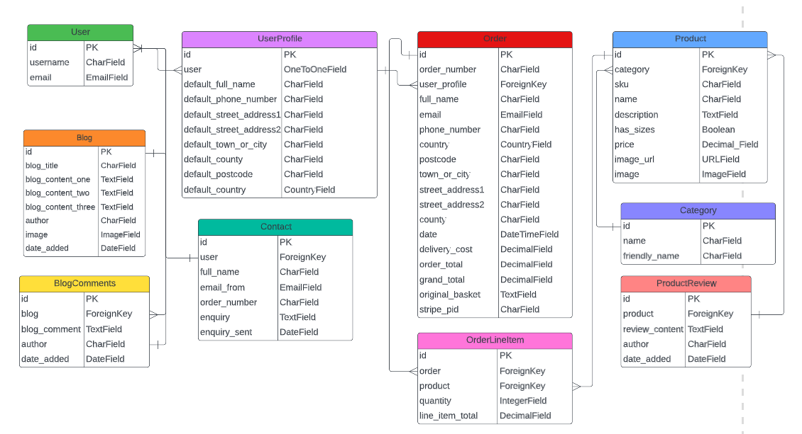

## Skeleton Plane

### Wireframes
The wireframes for this project were developed using [Balsamiq](https://balsamiq.com/).

| Mobile | Tablet| Desktop|
--------------------|--------------------|--------------------------|
| [Mobile](readme/assets/wireframes/mobile.png) | [Tablet](readme/assets/wireframes/tablet.png) | [Desktop](readme/assets/wireframes/desktop.png) |

### Changes to Wireframes
- In main nav options New In was replaced by Blogs. The blogs section provides an additional feature for users to explore and enjoy, allowing users to learn more about surfing and engage through leaving comments.
- User profile page was changed to a series of nav pills that open different sections of profile information accordingly. This was changed to improve user experience, with each section clearly labelled on the button options.
- Along with delete account, an 'Change password' button was added to allow users to change their password if they wish to do so.
- On the product detail page, the product information section was moved from the right to underneath the product image. This was to ensure a good, user friendly layout.
- On the product detail page a review section was added at the bottom. This displays a table with reviews left and for those logged in, and have not already left a review, a button that opens the product review form. 
- The layout of the shopping basket page was changed to allow for if a user had several items. The basket items are now displayed smaller and stacked on the left, with the basket summary information on the right.
- On the contact page, a cancel button was added to allow users to return to the home page.
- The blogs display page layout was changed. As the blogs are iterated through from the database, using a original layout would have been difficult. The blogs are now displayed in a grid, clearly with blog title and date.
- Blog detail page has only one image per blog.
- The checkout page has a order summary displayed so users can see what they are about to purchase. A back to basket button has also been added.
- On the checkout success page a button to the blogs page has been added to encourage users to read the blogs.
- On mobile screens the home page gallery is displayed the same as on desktop.
- On smaller screens a top nav was added, seperating the navbar toggle and site logo from the action icons. This ensures a good layout and easy access to all parts of the site.

## Surface Plane

During initial stages of development, I carried out research to explore what other surf websites looked like. From what I found, most surf websites are fairly simple in design, following standard layouts of e-commerce sites. In particular, I found two sites that I have taken inspiration from in the design and colour schemes; [Surfdome](https://www.surfdome.com/) and [Shore](https://www.shore.co.uk/).

### Colour Scheme

As mentioned above, I used inspiration from other surf websites whilst choosing the colour schemes. I decided that blue, an obvious choice with the correlation to water, and yellow, due to its bright and uplifting colour and it can represent the sun. 

Initially I chose two colours that I wanted to use. They are Yellow Orange and Cornflower Blue.

Following this, I used [Coolers](https://coolors.co/) to create a palette of complimentary colours.

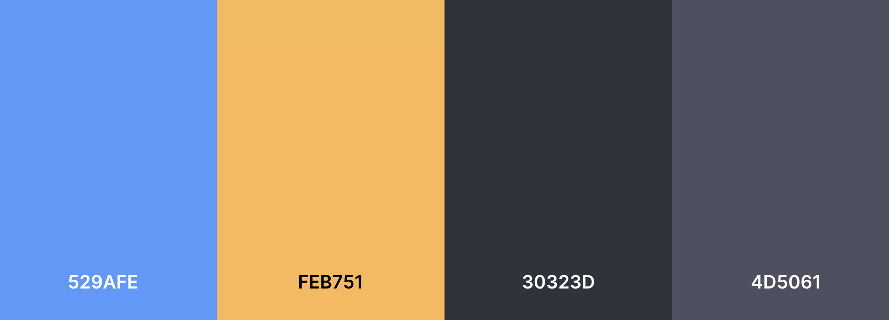

During development and testing, and following accessibility guidelines the Cornflower Blue was replaced with Azure, to ensure readability. Additionally the colour #4D5061 wasn't used as it wasn't required.

### Images

Initially a logo, created using [Adobe](https://www.adobe.com/express/create/logo), was going to be used. During initial stages of development I felt the logo did not fit well with the aesthetic of the site and decided to remove this. The brand logo was created using 'Source Sans Pro' font from Google Fonts.

### Typography

To ensure easy reading, consistency and a good user experience, I have chosen 'Akshar' font for content headings, 'Inter' for the main body of text and 'Source Sans Pro' for the site logo.
All fonts were chosen from [Google Fonts](https://fonts.google.com/).

## Technologies

### Languages
- HTML
- CSS3
- JavaScript
- Python

### Frameworks and Libraries

- [Am I Responsive?](http://ami.responsivedesign.is/) was used to create the mock ups.
- [AWS](https://aws.amazon.com/) was used to host static and media files required for the site.
- [Balsamiq](https://balsamiq.com/) was used to create the wireframes.
- [Bootstrap 5.1.3](https://getbootstrap.com/) was used to contribute to responsiveness and styling of the site.
- [Compress JPEG](https://compressjpeg.com/) was used to compress images before uploading.
- [Coolors](https://coolors.co/) was used to choose and match colours.
- [Django Secret Key Generator](https://djecrety.ir/) was used to generate a random secret key.
- [Font Awesome](https://fontawesome.com/) was used for button icons.
- Git was used for version control ad to push code to GitHub.
- [GitHub](https://github.com/) was used to store the repository.
- [GitPod](https://www.gitpod.io/) was used as the IDE to develop the project.
- [Google Chrome Developer Tools](https://developer.chrome.com/docs/devtools/) used throughout for design and development.
- [Google Fonts](https://fonts.google.com/) were used to select fonts for the site.
- [Heroku](https://www.heroku.com/) used to deploy the site.
- [jQuery](https://jquery.com/) was used to support some Bootstrap elements.
- [Lambdatest](https://www.lambdatest.com/) was used to check browser compatibility.
- [Online JavaScript Beautifier](https://beautifier.io/) was used to standardise HTML, CSS and JavaScript files.
- [Postgres](https://www.postgresql.org/) used to host database.
- [Stripe](https://stripe.com/en-gb) was used for online payment system.
- [SKU Generator](https://www.tradegecko.com/free-tools/sku-generator) was used to generate SKU numbers for products.

## Challenges

During development I came across challenges due to inexperience.
- Once AWS was set up, static files were intially loading but the media files were not. All settings were checked and I went through the set up process again to make sure my buckets, policies and keys were correct. I discovered that when loading the images into the bucket, I had not named them the same as what I was calling in the HTML files. Once changed, all media files loaded with no issues.
- I decided to change the DateTimeField to DateField in several models, as I didn't feel it was necessary to have a time stamp. After doing so it caused an issue in my local environemnt, as it affected the existing date in my sqlite database. As this was early in development and I only had some test data loaded, I used the flush command and it resolved the issue.
- I wanted to implement additional form validation. I tried the PhoneField and Regex. The PhoneField wasn't compatible with the sqlite so would have thrown issues when developing locally and when implementing the Regex validator, I had issues displaying an appropriate error message. I felt that if the form reloading and saying the form was invalid without indicating what the error is, would be confusing for the user. The Regex validator also conflicted with the checkout form and Stripe, causing payments to fail.
- 

## Testing

The testing process can be viewed [here](TESTING.md).

## Deployment

### Creation
* Following logging into my GitHub account, I created the repository from Code Institute's Gitpod Template. Selected 'Use this template', filled in repository name and created repository.

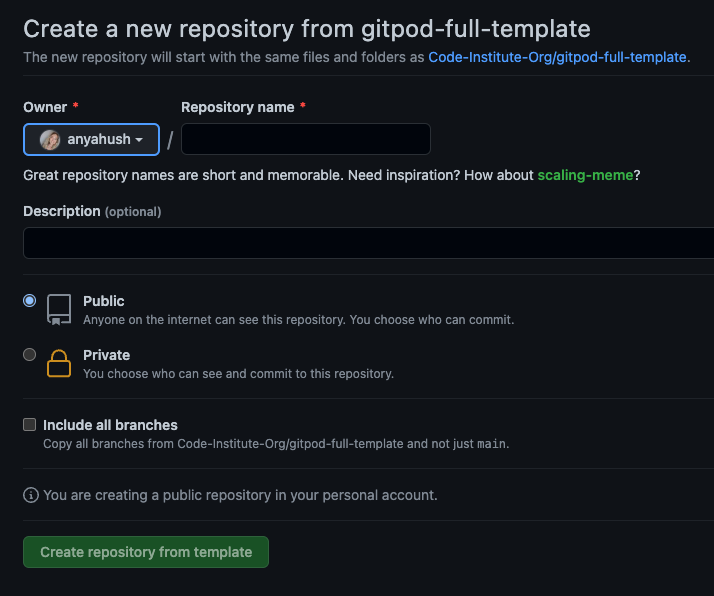
### Forking
* Sign into your GitHub account and go to this [repository](). 
* In the top right there are several options, including 'fork'. Select this to fork the repository.

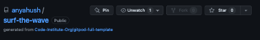

### Cloning
* Sign into your GitHub account and go to this [repository](). In addition to the cloning steps you will need to follow steps for setting up AWS, Stripe and Heroku.
* Clone using command line
    - Select button 'Code' next to Gitpod button and copy the URL

    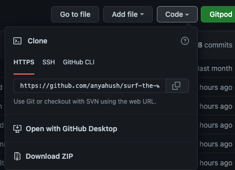
    - In your workspace terminal type 'git clone' followed by the URL and press enter
* Clone using Desktop GitHub
    - If you select this, it will guide you through the necessary steps

For more information on troubleshooting see the GitHub documentation [here](https://docs.github.com/en/repositories/creating-and-managing-repositories/cloning-a-repository#about-cloning-a-repository).

### Setting up the Project
* The project has a set of requirements needed for the project to run. You can install these with pip3 install. The requirements are below.
* If you have cloned the project then you can use pip3 install -r requirements and it will install all requirements needed 

* Create a SECRET_KEY. I used a [Django Secret Key Generator](https://miniwebtool.com/django-secret-key-generator/).
* The settings.py file is set up to collect keys from the environment. During development these were stored in my Gitpod dashboard. Name the variables accordingly. DEVELOPMENT is set to True.

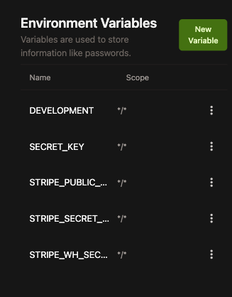

* Requirements.txt and Procfile are necessary for Heroku deployement. Make sure these have been committed and pushed before deployement. Use command pip3 freeze > requirements.txt to ensure the file is up to date.
* During development migrations need to be run using commands:
    - python3 manage.py makemigrations --dry-run
    - python3 manage.py makemigrations
    - python3 manage.py migrate --plan
    - python3 manage.py migrate
* To create a superuser use the command python3 manage.py createsuperuser and follow the steps

### Setting up AWS
* First you need to [register](https://aws.amazon.com/?nc2=h_lg) for an account if you don't already have one. I am using the Free Tier.
* Once created, search S3, select and create bucket
* Fill in bucket name, select nearest region and unselect 'block all public access' checkbox. Then select to create bucket
* Once created
    - Go to Properties section and go to Static Web Hosting, select Edit and Enable and enter default values for index and error documents and click Save.

    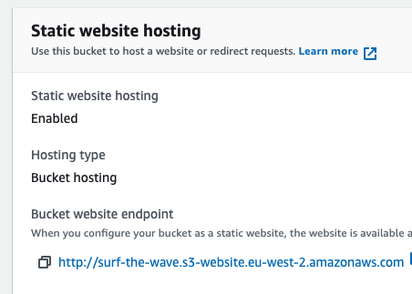
    - On permissions tab, paste this configuration into CORS section

    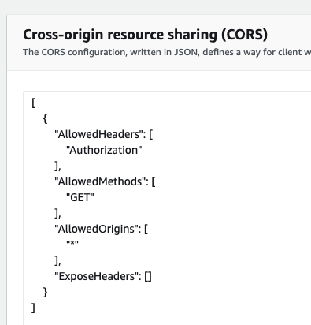
    - Go to Bucket Policy section and select 'policy generator'

    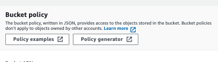
    - In the policy generator select 'S3 Bucket Policy' for type, enter a (*) into 'Principal' input and select 'Get Object' from Actions Dropdown.
    - Copy Amazon Resource Number (ARN) from previous tab and paste into ARN box. Select 'Add Statement' and then 'Generate Policy'.
    - Copy policy and paste in Bucket Policy Editor and add a (/*) onto end of the resource key and click save.
    - Go to Access Control List and click Edit. Check Everyone(Public Access) and confirm you understand the changes.
    - Search for IAM in AWS Services and click 'User Groups' and select to create a new group

    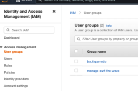
    - Give group a name and click 'Next Step' until 'Create Group', select this.
    - On menu select 'Policies' and then 'Create Policy' then select 'Import Policy' and search 'S3' and import 'AmazonS3FullAccess' policy.
    - Amend policy by adding your ARN as the value for resource as list in the format as follows:
        * "arn:aws:<ARN>",
        * "arn:aws:<ARN/*>",
    - Click 'Next: Tags' and 'Next: Review'
    - Provide policy name and click 'Create Policy'
    - Got to IAM menu and select 'Users' and add user. Fill in name and select 'Access key- Programmmic Access'.
    - Add user to group, by selecting the user. Select 'Next' and 'Create User'.
    - Download CSV file, as this has the keys required. Once you leave this page you won' be able to download or access the keys again.
    - The AWS keys need to be added to you Heroku Config Vars. In projects settings.py replace AWS_STORAGE_BUCKET_NAME with your bucket name.
    - Back in your AWS bucket. Select bucket and click 'Create Folder', name it 'media' and create. You can now add media files to it.

### Setting up Stripe
* First you need to [register](https://stripe.com/en-gb) for an account with Stripe, if you don't have one already.
* In the dashboard, go to section for Developers and select 'API keys'. Here you will get your publishable and secret keys. These are not to go in version control. These can be stored in GitHub environment during development and Heroku Config Vars if deploying.

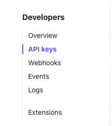

* Next go to 'Webhooks' in the side menu. Select 'Add endpoint'

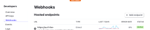

* Add the url in for the site followed by /checkout/wh/
* If deploying, you will need to create a new endpoint with the deployed URL
* Next select the events you want for the webhooks, once selected then 'Add Endpoint'.
* In your new webhook there is a signing secret. Copy this and add to variable STRIPE_WH_SECRET in GitHub environment. When creating endpoint for Heroku, this will create a new signing secret.

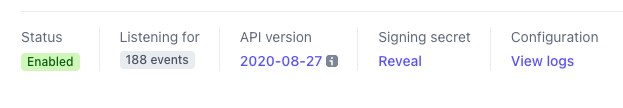

### Heroku Deployment
* Firstly login into your [Heroku](https://id.heroku.com/login) account.
* Select 'New' and then 'Create New App', give it a name and select closest region and click 'Create App'.
* In Resources under Add-ons select 'Heroku Postgres'

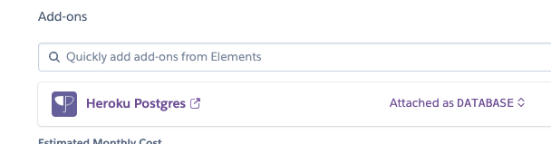

* Once the app is created, go to settings and reveal Confif Vars and add the following:
    * Note: the DATABASE_URL was already populated, USE_AWS is set to True and the AWS_SECRET_KEY was generated using the Django Secret Key Generator. 

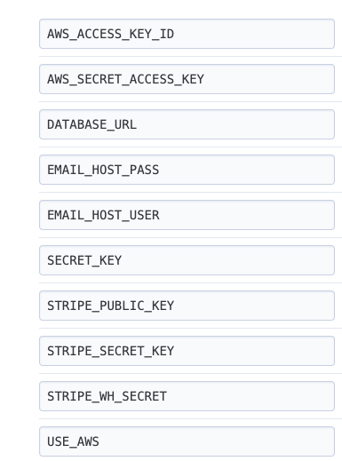
* Go to 'Deploy' and select 'Heroku Git'. Currently Heroku has stopped automatic deploys with GitHub
* Once deployed commits need to be manually pushed to both GitHub and Heroku. Using the command git push heroku main will push to Heroku
* You will need to migrate and create a superuser. Migrations can be done with the previous steps with 'heroku run' infront. E.g heroku run python3 manage.py makemigrations.

## Credits

### Content
* Product content from [Shore](https://www.shore.co.uk/) website.
* 'In Scotland We Surf' blog from [North Core](https://www.northcore-europe.com/blog/in-scotland-we-surf.html).
* 'END OF THE LAND: THE LUCY SMALL EPISODE' blog from [Surfdome](https://www.surfdome.com/blog/end-of-the-land-the-lucy-small-episode?_ga=2.96904031.1780410518.1653050895-949459365.1653050895).

### Code Content
* README layout and style used from previous [project](https://github.com/anyahush/protect-our-planet-quiz).
* [Code Institute's Boutique Ado](https://github.com/Code-Institute-Solutions/boutique_ado_v1) walkthrough project was used throughout as a guide.
* Image hover effect on image gallery modified from [W3 Schools Tutorial](https://www.w3schools.com/howto/tryit.asp?filename=tryhow_css_image_overlay_opacity) and [Shore's website](https://www.shore.co.uk/).
* The shopping basket page modified code from [Surfdome](https://www.surfdome.com/).
* The topnav styling, autofocus on inputs and navbar pill layout and accompanying JavaScript in the user profile were modified from [GymFit](https://github.com/nlenno1/gym-fit-MS4).
* The quantity dropdown selector on product detail and basket pages modified from Boutique Ado and [Batch Coffee](https://github.com/fayskerritt/batch-coffee).
* Adding admin link to navbar and delete_user view were used from [Music to my Ears](https://github.com/natalie-kate/music_to_my_ears).
* Dynamically generating modals for items in a for loop was used from [Stack Overflow](https://stackoverflow.com/questions/42441574/passing-information-to-modal-in-for-loop).
* Profile section 'My Account' wording and style modified from [ASOS](https://www.asos.com/men/).

### Images
* Images on the home page gallery from Pexels and Unsplash:
    - [Surfboard and van](https://www.pexels.com/photo/surfboard-in-a-van-8241135/)
    - [Surfing pink sunset](https://www.pexels.com/photo/man-doing-surfing-at-golden-hour-416726/)
    - [Sea with lots of surfers](https://www.pexels.com/photo/bird-s-eye-view-of-body-of-water-1667004/)
    - [Watery wetsuit](https://unsplash.com/photos/kUqD6pkMYfI)
    - [Surfboards](https://unsplash.com/photos/1kXi2x9t9Fg)
    - [Surfer out at sea](https://unsplash.com/photos/KxQYNqp329Y)
* Product images from [Shore](https://www.shore.co.uk/) website.
* Image for 'In Scotland We Surf' blog from [Pexels](https://www.pexels.com/photo/person-surfing-3147548/).
* Image for 'END OF THE LAND: THE LUCY SMALL EPISODE' blog from [Surfdome](https://www.surfdome.com/blog/end-of-the-land-the-lucy-small-episode?_ga=2.96904031.1780410518.1653050895-949459365.1653050895).
* 

## Acknowledegments
- Code Institute tutors and Slack community for help and guidance
- My mentor Precious Ijege for his help and guidance throughout
- My mini-Feb group on Slack for moral support and feedback

