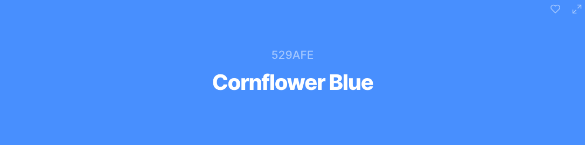

# Surf the Wave

Deployed website can be viewed [here]().

## Table of Contents
---
1. [Project Goals]()
2. [UX]()
3. [Strategy Plane]()
    * [User Stories]()
4. [Scope Plane]()
    * [Existing Features]()
    * [Features Left to Implement]()
5. [Structure Plane]()
6. [Skeleton Plane]()
7. [Surface Plane]()
8. [Technologies]()
9. [Testing]()
10. [Deployment]()
11. [Credits]()
12. [Acknowledgements]()

---

## Project Goals

The project goals for this site is to develop "a full stack e-commerce  site using buisness logic used to control a centrally-owned dataset."

## UX Design

## Strategy Plane

### Site Owner Goals
- Promote surf shop buisness and increase sales of surf boards and equipment
- Increase online status and promote the site on social media
- Encourage the uptake of surfing, amongst all ages and genders, through blog posts and social media

### Demograghic
- All genders and ethnicities
- All levels of surfing
- Ages 7+

### User Stories

- As a first time visitor:
    * I want to easily navigate throughout the site.
    * I want to understand the purpose of the site easily.
    * I expect an attractive site that contributes to my good experience.
    * I want the site to be accessible.
    * I want the site to be responsive across all devices.

- As an unregistered visitor:
    * I want to be able to search and filter products easily and efficiently.
    * I want to be able to sort and view products according to type, price and name.
    * I want to be able to be able to view product detail so I can find information about price, size and description.
    * I want to be able to add products to my shopping basket.
    * I want to be able to view my shopping basket.
    * I want to be able to edit my shopping basket.
    * I want to be able to view the total cost of my basket.
    * I want to be able to complete the checkout process and be able to enter payment information easily.
    * I want to be able to view a confirmation of my order once the checkout process is complete.
    * I want to be able to received an email confirmation of my order.
    * I want to be able to register easily for an account.
    * I want to be able to access the blog posts.

- As a registered visitor:
    * I want to be able to receive a confirmation email upon registration.
    * I want to be able to view my personalised profile.
    * I want to be able to save and edit personal information on my profile.
    * I want to be able to view my order history.
    * I want to be able to login an logout with ease.
    * I want to be able to leave comments on the blog posts.
    * I want to be able to delete my account.
    * I want to be able to change my password if I forget it.

- As a returning visitor:
    * I want to be able to find social media links.
    * I want to be able to contact the site owner if I have any queries.
    * I want to enjoy using the site without never ending scrolling.

- As a superuser:
    * I want to be able to add new products.
    * I want to be able to edit or delete existing products.
    * I want to be able to add new categories.
    * I want to be able to add new blog posts.
    * I want to be able to edit or delete existing blog posts.
    * I want to be able to delete blog comments left by users. 
    * I want to be able to delete a user.
    * I want to be able to make another user admin.
    * I want to inform users of products that are out of stock, and prevent users from purchasing them.

### Opportunity Goal Table

During the initial strategy planning, the opportunities of the site were determined and values were given according to their imporance and viability at this stage.

| Opportunity | Importance | Viability |
| ----------- | ---------- | --------- |
| 1. |  |  |
| 2. |  |  |
| 3. |  |  |
| 4. |  |  |
| 5. |  |  |
| 6. |  |  |
| 7. |  |  |

## Scope Plane

### **Existing Features**

### **Features Left to Implement**

## Structure Plane 

### Database 

## Skeleton Plane

### Wireframes
The wireframes for this project were developed using [Balsamiq](https://balsamiq.com/).

| Mobile | Tablet| Desktop|
--------------------|--------------------|--------------------------|
| [Mobile](readme/assets/wireframes/mobile.png) | [Tablet](readme/assets/wireframes/tablet.png) | [Desktop](readme/assets/wireframes/desktop.png) |

### Changes to Wireframes

## Surface Plane

During initial stages of development, I carried out research to explore what other surf websites looked like. From what I found, most surf websites are fairly simple in design, following standard layouts of e-commerce sites. In particular, I found two sites that I have taken inspiration from in the design and colour schemes; [Surfdome](https://www.surfdome.com/) and [Shore](https://www.shore.co.uk/).

### Colour Scheme

As mentioned above, I used inspiration from other surf websites whilst choosing the colour schemes. I decided that blue, an obvious choice with the correlation to water, and yellow, due to its bright and uplifting colour and it can represent the sun. 

Initially I chose two colours that I wanted to use. They are Yellow Orange and Cornflower Blue.

Following this, I used [Coolers](https://coolors.co/) to create a palette of complimentary colours.

### Images

The logo for the site was created using [Adobe](https://www.adobe.com/express/create/logo).

### Typography

To ensure easy reading, consistency and a good user experience, I have chosen Akshar font from [Google Fonts](https://fonts.google.com/).

## Technologies

### Languages
- HTML
- CSS3
- JavaScript
- Python

### Frameworks and Libraries

- [Adobe](https://www.adobe.com/express/create/logo) was used to create the site logo.
- [Am I Responsive?](http://ami.responsivedesign.is/) was used to create the mock ups.
- [Balsamiq](https://balsamiq.com/) was used to create the wireframes.
- [Bootstrap 5.1.3](https://getbootstrap.com/) was used to contribute to responsiveness and styling of the site.
- [Font Awesome](https://fontawesome.com/) was used for button icons.
- Git was used for version control ad to push code to GitHub.
- [GitHub](https://github.com/) was used to store the repository.
- [GitPod](https://www.gitpod.io/) was used as the IDE to develop the project.
- [Google Fonts](https://fonts.google.com/) were used to select fonts for the site.
- [Lambdatest](https://www.lambdatest.com/) was used to check browser compatibility.
- [Online JavaScript Beautifier](https://beautifier.io/) was used to standardise HTML, CSS and JavaScript files.

## Testing

The testing process can be viewed [here]().

## Deployment

## Credits

### Content

#### Question Content

#### Code Content
* README layout and style used from previous [project](https://github.com/anyahush/protect-our-planet-quiz).

### Media

#### Images

#### Sound

## Acknowledegments

