# Testing

## Table of Contents
---
1. [Code Validation]()
    * [HTML Validation]()
    * [CSS Validation]()
    * [JavaScript Validation]()
    * [Python Validation]()
2. [Testing User Stores]()
3. [Responsiveness]()
4. [Browser Compatibility]()
5. [Performance]()
6. [Manual Testing]()
7. [Bugs]()
    * [Found and Fixed]()
    * [Existing]()

### Code Validation

### Testing User Stories

- As a first time visitor:
    1. I want to easily navigate throughout the site.
        - Across all device screen sizes there is a navbar with options to get around the site. 
        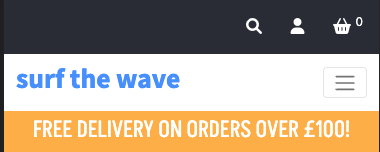
        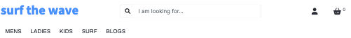
    2. I want to understand the purpose of the site easily.
        - On the home page the images, name of site and navbar options clearly indicate that it is a surf shop
        - The image gallery and text make the user aware of the latest stock and blogs
        
    3. I expect an attractive site that contributes to my good experience. -ADD ONCE LIGHTHOUSE TESTING DONE
    4. I want the site to be accessible. - ADD ONCE LIGHTHOUSE TESTING DONE
    5. I want the site to be responsive across all devices.
        - Throughout development responsiveness has been considered. Using Bootstrap and media queries the site is accessible across all devices.

- As an unregistered visitor:
    1. I want to be able to search and filter products easily and efficiently.
        - A searchbar input field allows users to search by product, description or category
        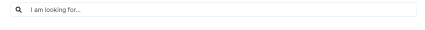
        - Product category badges allow users to filter which category they want to look at
        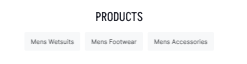
        - Navbar dropdown menus have categories listed so users can easily filter which products they want to look at
        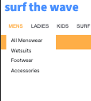
    2. I want to be able to sort and view products according to type, price and name.
        - The sort selector dropdown allows users to sort products based on price, name or category
        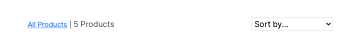
    3. I want to be able to be able to view product detail so I can find information about price, size and description.
        - The product detail page displays product information clearly for the user
        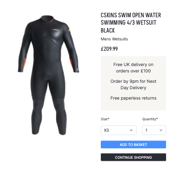
    4. I want to be able to add products to my shopping basket.
        - On the product detail page an 'Add to basket' button allows users to add products to their bags.
        
    5. I want to be able to view my shopping basket.
        - Users can click on shopping basket icon in navbar or 'Proceed to basket' button on toast message
        - The basket page displays all products added to basket and an order summary
        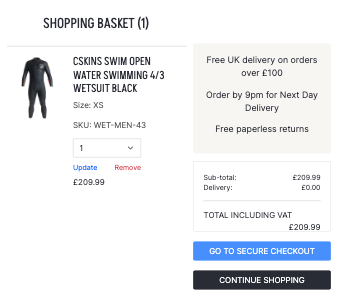
    6. I want to be able to edit my shopping basket.
        - A quantity selector dropdown allows users to change the quantity and use the update link to update the amount
        - The remove link allows users to remove item completely from their basket
        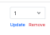
    7. I want to be able to view the total cost of my basket.
        - In the shopping basket page the total cost with breakdown of order total and delivery cost are displayed
        - Total cost of basket is also displayed in toast messages if the user is not on the basket or profile pages
    8. I want to be able to complete the checkout process and be able to enter payment information easily.
        - The checkout page displays checkout form. This is clearly labelled with input labels and placeholders
        - Stripe card payment section is available for card payments
        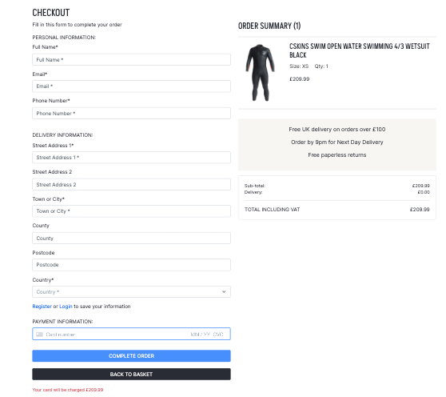
    9. I want to be able to view a confirmation of my order once the checkout process is complete.
        - The checkout success page displays an order confirmation for the user
        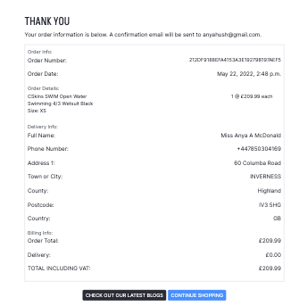
    10. I want to be able to received an email confirmation of my order.
        - Following a successful order an orde confirmation email is sent
        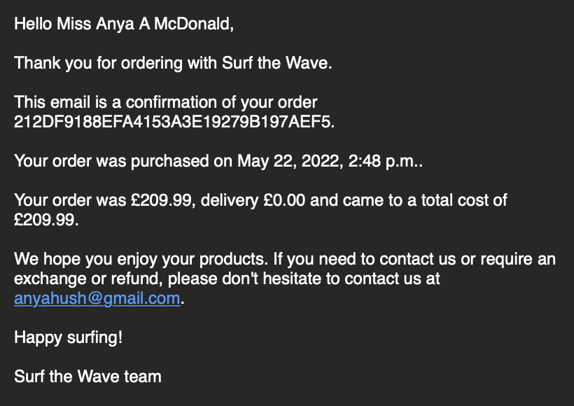
    11. I want to be able to register easily for an account.
        - In the user dropdown menu, users can select to register for an account
        - The register account form is simple and clearly labelled
        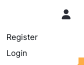
        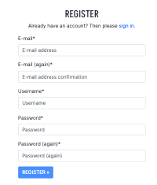
    12. I want to be able to access the blog posts.
        - Following the blog navlink, it takes users to the blogs page. All users can view blog posts
        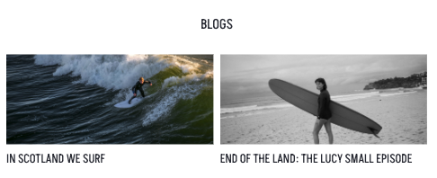
        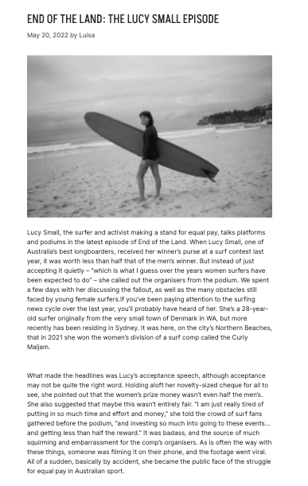

- As a registered visitor:
    * I want to be able to receive a confirmation email upon registration.
        - Users receive a confirmation email to verify their email address
        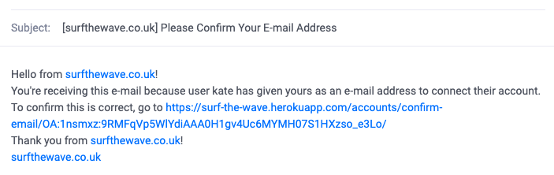
    * I want to be able to view my personalised profile.- ADD ONCE LIGHTHOUSE done
    * I want to be able to save and edit personal information on my profile. -ADD ONCE LIGHTHOUSE done
    * I want to be able to view my order history.
        - On the users profile page, users can view their order history
        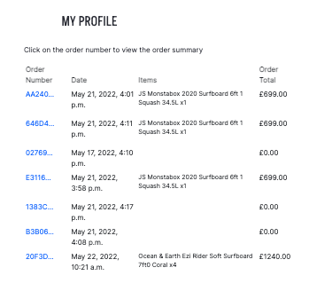
    * I want to be able to login and logout with ease.
        - Users select the dropdown to login, which takes them to the login form
        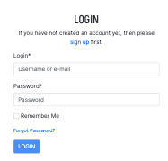
        - Users can select the dropdown to logout, or if on the profile page their is a logout button
        
    * I want to be able to leave reviews on products.
        - Logged in users can leave one review per product
        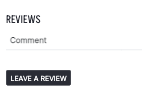
    * I want to be able to edit or delete my reviews.
        - Users can edit or delete their own reviews
        
    * I want to be able to leave comments on the blog posts.
        - Logged in users can leave one comment per blog post
        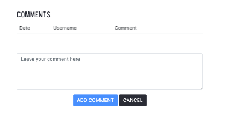
    * I want to be able to edit or delete comments on blog posts.
        - Users can edit or delete their own comments
        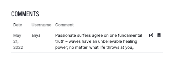
    * I want to be able to delete my account.
        - Under 'My Account' on the profile page, users can delete their account
        -
    * I want to be able to change my password to keep my account secure.
        - Under 'My Account' on the profile page, users can change their password 
        
    * I want to be able to reset my password if I forget it.
        - On the login page, users can click a link to reset their password if they have forgotten it
        

- As a returning visitor:
    * I want to be able to find social media links.
        - In the footer, across all pages, users can find links to the sites social media accounts
        
    * I want to be able to contact the site owner if I have any queries.
        - In the footer, across all pages, their is a link to the contact form
        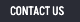
        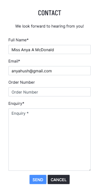
    * I want to enjoy using the site without never ending scrolling.
        - In the footer, across all pages, their is a 'Back to top' link
        

- As a superuser:
    * I want to be able to add new products.
        - From the navbar dropdown or in the profile page, superusers can add new products
        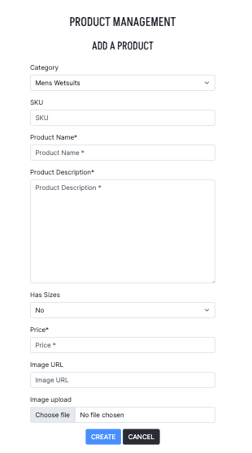
    * I want to be able to edit or delete existing products.
        - On the products page and each product detail page, edit and delete links allow superusers to edit or delete products
        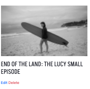
        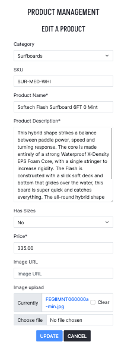
    * I want to be able to add new categories.
        - In the admin portal, accessed from the admin navlink, superusers can add new categories
        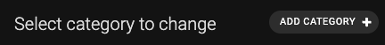
        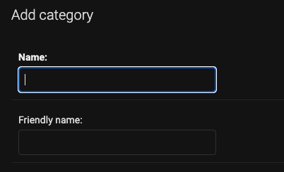
    * I want to be able to add new blog posts.
        - From the navbar dropdown or in the profile page, superusers can add new blogs
        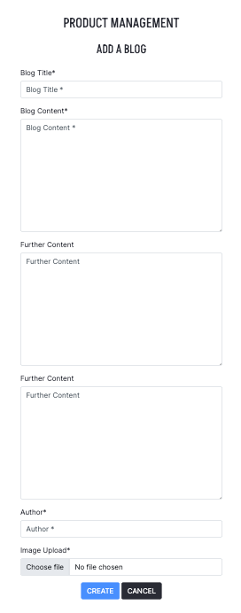
    * I want to be able to edit or delete existing blog posts.
        - On the blogs page and each blog detail page, edit and delete links allow superusers to edit or delete blogs
        
        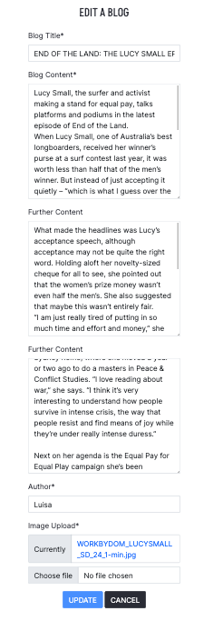
    * I want to be able to delete blog comments left by users.
        - A delete comment button is displayed for superusers to delete any comment left
        
    * I want to be able to delete user reviews left on products.
        - A delete review button is displayed for superusers to delete any review left
        
    * I want to be able to access the Django admin portal easily
        - In the superuser user option dropdown there is a link to the admin portal
        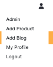
    * I want to be able to delete a user.
        - In the admin portal, superusers can delete any user
        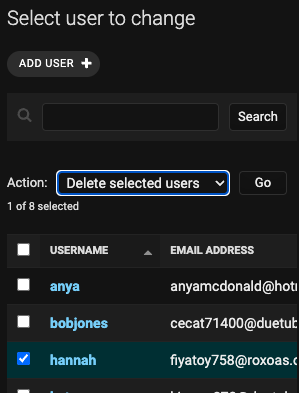
    * I want to be able to make another user admin.
        - In the admin portal, superusers can make other users admin
        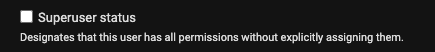

### Responsiveness

### Browser Compatibility

### Performance

### Manual Testing

### Bugs

#### Found and Fixed

- Whilst setting up webhooks there was issues with the webhook being sent back from Stripe. With investigation and searching on Slack and through web searches I found that I hadn't changed the port to public, so Stripe wasn't able to connect.
    * Solution: Port was changed to public.
- Once the webhook handler for payment_intent_succeeded had been updated to be able to get or create orders to be stored, I found an issues with street_address2. The webhook was failing and displaying a 'NOT NULL constraint' error. I discovered that in the Order model I had set null=False, instead of null=True. 
    * Solution: Order model updated with street_address2, null=True

#### Existing
