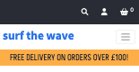
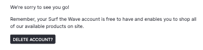
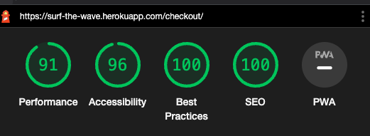
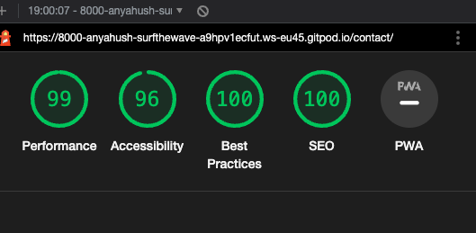
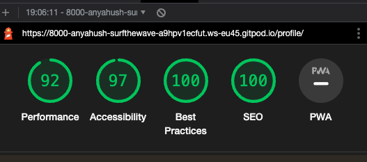

# Testing

## Table of Contents
---
1. [Code Validation]()
    * [HTML Validation]()
    * [CSS Validation]()
    * [JavaScript Validation]()
    * [Python Validation]()
2. [Testing User Stores]()
3. [Responsiveness]()
4. [Browser Compatibility]()
5. [Performance]()
6. [Manual Testing]()
7. [Bugs]()
    * [Found and Fixed]()
    * [Existing]()

### Code Validation

#### HTML Validation

HTML Validation was carried out on all pages of the site using [W3C HTML Validator](https://validator.w3.org/nu/). 
A number of errors came back across the site:
* Button elements being placed inside anchor links
* Incorrect aria-labelledby attribute values
* Documents with two autofocus attributes
* Number of rows and columns in tables not equal to data provided
* Unnecessary type attribute in JavaScript script element
* Value attribute added to select element
* Placeholders on image upload fields

Once these were amended, the site returns no HTML validation errors. 

Below shows some of the errors present whilst validating.

#### CSS Validation

CSS validation was carried out on all CSS files in the repository using [W3C CSS Validation Service](https://jigsaw.w3.org/css-validator/). All pages returned successful validation. Two pages returned warnings that the border colour and background colour of button elements were the same. The unncessary border colours were removed, and the warnings subequently resolved.

#### JavaScript Validation

JavaScript validation was carried out on all JavaScript files and JavaScript code within HTML files using [JSHint](https://jshint.com/). The only errors to come back initially were missing semi-colons and in one instance, an extra semi-colon. Additionally, some definition issues were raised but these are in relation to using Bootstrap elements.

After correcting the semi-colons, all JavaScript passed validation.

#### Python Validation

Python validation was carried out on all Python files using [PEP8 Validator](http://pep8online.com/). 
Initial errors returned were:
* Lines too long
* Indentation errors
* Missing blank space at end of file
* Missing docstrings

Once these were resolved all Python files returned a successful validation result. 

### Testing User Stories

- As a first time visitor:
    1. I want to easily navigate throughout the site.
        - Across all device screen sizes there is a navbar with options to get around the site.

        
        

    2. I want to understand the purpose of the site easily.
        - On the home page the images, name of site and navbar options clearly indicate that it is a surf shop
        - The image gallery and text make the user aware of the latest stock and blogs

        
    3. I expect an attractive site that contributes to my good experience.
        - The colours, layout and style have been chosen to ensure a good user experience
        - Some design aspects have been modelled on other successful surf e-commerce sites

        

    4. I want the site to be accessible.
        - All anchor links have aria-labels, images have alt attributes and the colours pass the Lighthouse accessibility checks.
        - Placeholders and form labels have been used throughout to ensure accesbility is available throughout the site.
    5. I want the site to be responsive across all devices.
        - Throughout development responsiveness has been considered. Using Bootstrap and media queries the site is accessible across all devices.

- As an unregistered visitor:
    1. I want to be able to search and filter products easily and efficiently.
        - A searchbar input field allows users to search by product, description or category

        
        - Product category badges allow users to filter which category they want to look at

        
        - Navbar dropdown menus have categories listed so users can easily filter which products they want to look at

        
    2. I want to be able to sort and view products according to type, price and name.
        - The sort selector dropdown allows users to sort products based on price, name or category
    
        
    3. I want to be able to be able to view product detail so I can find information about price, size and description.
        - The product detail page displays product information clearly for the user

        
    4. I want to be able to add products to my shopping basket.
        - On the product detail page an 'Add to basket' button allows users to add products to their bags.

        
    5. I want to be able to view my shopping basket.
        - Users can click on shopping basket icon in navbar or 'Proceed to basket' button on toast message
        - The basket page displays all products added to basket and an order summary

        
    6. I want to be able to edit my shopping basket.
        - A quantity selector dropdown allows users to change the quantity and use the update link to update the amount
        - The remove link allows users to remove item completely from their basket

        
    7. I want to be able to view the total cost of my basket.
        - In the shopping basket page the total cost with breakdown of order total and delivery cost are displayed
        - Total cost of basket is also displayed in toast messages if the user is not on the basket or profile pages
    8. I want to be able to complete the checkout process and be able to enter payment information easily.
        - The checkout page displays checkout form. This is clearly labelled with input labels and placeholders
        - Stripe card payment section is available for card payments

        
    9. I want to be able to view a confirmation of my order once the checkout process is complete.
        - The checkout success page displays an order confirmation for the user

        
    10. I want to be able to received an email confirmation of my order.
        - Following a successful order an orde confirmation email is sent

        
    11. I want to be able to register easily for an account.
        - In the user dropdown menu, users can select to register for an account
        - The register account form is simple and clearly labelled

        

        
    12. I want to be able to access the blog posts.
        - Following the blog navlink, it takes users to the blogs page. All users can view blog posts

        

        

- As a registered visitor:
    * I want to be able to receive a confirmation email upon registration.
        - Users receive a confirmation email to verify their email address

        
    * I want to be able to view my personalised profile.
        - Users can view their profile, which has personal information and order history saved
    * I want to be able to save and edit personal information on my profile.
        - Users can save default information to their profile
        - Users can edit this at any point

        
    * I want to be able to view my order history.
        - On the users profile page, users can view their order history

        
    * I want to be able to login and logout with ease.
        - Users select the dropdown to login, which takes them to the login form

        
        - Users can select the dropdown to logout, or if on the profile page their is a logout button

        
    * I want to be able to leave reviews on products.
        - Logged in users can leave one review per product

        
    * I want to be able to edit or delete my reviews.
        - Users can edit or delete their own reviews

        
    * I want to be able to leave comments on the blog posts.
        - Logged in users can leave one comment per blog post

        
    * I want to be able to edit or delete comments on blog posts.
        - Users can edit or delete their own comments

        
    * I want to be able to delete my account.
        - Under 'My Account' on the profile page, users can delete their account

        -
    * I want to be able to change my password to keep my account secure.
        - Under 'My Account' on the profile page, users can change their password

        
    * I want to be able to reset my password if I forget it.
        - On the login page, users can click a link to reset their password if they have forgotten it

        

- As a returning visitor:
    * I want to be able to find social media links.
        - In the footer, across all pages, users can find links to the sites social media accounts

        
    * I want to be able to contact the site owner if I have any queries.
        - In the footer, across all pages, their is a link to the contact form

        

        
    * I want to enjoy using the site without never ending scrolling.
        - In the footer, across all pages, their is a 'Back to top' link

        

- As a superuser:
    * I want to be able to add new products.
        - From the navbar dropdown or in the profile page, superusers can add new products

        
    * I want to be able to edit or delete existing products.
        - On the products page and each product detail page, edit and delete links allow superusers to edit or delete products

        

        
    * I want to be able to add new categories.
        - In the admin portal, accessed from the admin navlink, superusers can add new categories

        

        
    * I want to be able to add new blog posts.
        - From the navbar dropdown or in the profile page, superusers can add new blogs

        
    * I want to be able to edit or delete existing blog posts.
        - On the blogs page and each blog detail page, edit and delete links allow superusers to edit or delete blogs

        

        
    * I want to be able to delete blog comments left by users.
        - A delete comment button is displayed for superusers to delete any comment left

         

    * I want to be able to delete user reviews left on products.
        - A delete review button is displayed for superusers to delete any review left

        
    * I want to be able to access the Django admin portal easily
        - In the superuser user option dropdown there is a link to the admin portal

        
    * I want to be able to delete a user.
        - In the admin portal, superusers can delete any user

        
    * I want to be able to make another user admin.
        - In the admin portal, superusers can make other users admin

        
    
    * I want to be notified when a user fills out the contact form, so I don't have to check the admin portal constantly.
        - When a user completes the contact form, an email is sent to the DEFAULT_FROM_EMAIl to notify the admin that someone has contacted the site

        Email sent by user to site 

        

        Email sent to admin, notifying of user contact

        

### Responsiveness
The responsiveness was tested using [Mobile Compatibility Tester]() and [Google Chrome Developer Tools]().

The Mobile Compatibility tester returned good results for all pages that could be tested. Pages such as profile page, add product and create review, that required user authentication, could not be tested with this site. Responsiveness testing was carried out with Chrome DevTools. Additionally, real world testing was carried out on my iPhone 13, macBook Pro 13" and Lenovo PC screen (2500px) and Lenovo laptop 11".

Some changes were made during testing to enhance responsiveness:
* On some pages such as the profile page, margins were added between the action buttons on screens under 425px
* Margins were removed from the main nav and on smaller screens the logo font size was reduced to improve user experience, as it gives for screen space for scrolling and exploring the site
* The delivery banner font size was reduced on smaller screens

Below are the results are displayed.

### Browser Compatibility

The site was manually tested on Chrome 101, Microsoft Edge 101 and Safari 15.1. Additionally the site was checked on [Lamdatest](https://www.lambdatest.com/) for Firefox 89 and Opera 74. All browsers tested produced good compatibility and user experience results. 

### Performance
To test performance across various areas, I used Google Chrome Developer Lighthouse Tools. Some of the performance scores are not as high as I would like. There are a few areas that caused these lower scores:
- Stripe reccomends having their documentation on every page
- Eliminate render blocking- this was caused by my CSS file and other libraries such as Font Awesome. These have been left in the head
- Serve images in gen formats- this is not something I was aware of. My images are in png format, but I will know for future development.
- Use HTTP/2- this is not something I was sure how to control. 

#### Home Page
- Mobile

- Desktop

#### Products Page
- Mobile

- Desktop

#### Product Detail Page
- Mobile

- Desktop

#### Add Product Page
- Mobile

- Desktop

#### Edit Product Page
- Mobile

- Desktop

#### Create Review Page
- Mobile

- Desktop

#### Edit Review Page
- Mobile

- Desktop

#### Basket Page
- Mobile

- Desktop

#### Checkout Page
- Mobile

- Desktop

#### Checkout Success Page
- Mobile

- Desktop

#### Contact Page
- Mobile

- Desktop

#### Profile Page
- Mobile

- Desktop

#### Blogs Page
- Mobile

- Desktop

#### Blog Detail Page
- Mobile

- Desktop

#### Add Blog Page
- Mobile

- Desktop

#### Edit Blog Page
- Mobile

- Desktop

#### Edit Blog Comment Page
- Mobile

- Desktop

### Manual Testing

To test the functionality, usability responsiveness and data management of this site rigorous manual testing was carried out. See the full [Manual Testing Document](test-case-report.pdf) to see the results.

In addition to my own manual testing, I shared my project with others to gain feedback and insight. There comments and feedback are displayed below.

| Peer  | Comment | Outcome |
--------------------|--------------------|--------------------------|
| Nick Lennon  | Suggested limiting the number of comments and reviews left or limiting length of comment| Logged in users can only leave one comment/review per blog/comment and a max-length of 250 characters implemented|
| Nick Lennon | Suggested having the email field pre-populated on profile | User form created so user email taken from user login rather than profile form |
| Nick Lennon | Suggested having back to product link on basket page | Back to product link added to product name |
| Nick Lennon | Suggested having a back to profile button on logout page | Back to profile button added |
| Vanessa Cleary | When going through checkout process an error occurred when logged in but could checkout as a guest was able to checkout successfully | The checkout form was trying to get email from default_email rather than the user. This was updated. |
| Maggie Walsh | Tested checkout process but got a server error when 'Go to secure checkout' was clicked. | Checkout process thoroughly checked and no issues. Maggie later tried and it worked with no issues |

### Automated Testing

Automated testing is new to me so decided that I would carry out thorough and robust manual testing and try some autmated testing to compliment. I have carried out some testing across all apps. This is something I tend to explore further and build on my skills, and will explore futher testing of this site in future development. 

### Bugs

#### Found and Fixed

- Whilst setting up webhooks there was issues with the webhook being sent back from Stripe. With investigation and searching on Slack and through web searches I found that I hadn't changed the port to public, so Stripe wasn't able to connect.
    * Solution: Port was changed to public.
- Once the webhook handler for payment_intent_succeeded had been updated to be able to get or create orders to be stored, I found an issues with street_address2. The webhook was failing and displaying a 'NOT NULL constraint' error. I discovered that in the Order model I had set null=False, instead of null=True. 
    * Solution: Order model updated with street_address2, null=True
- Initial deployment resulted in failed attempts. Through investigation I found that the version of Python used within my local enviorment was conflicting with the standard version used by Heroku.
    * A runtime.txt file was added stating the version of Python used in the project
- On the basket page there was a delete confirmation modal when a user removed an item from their basket. This was removing the first item regardless of the one they were selecting. After some research across other sites such as ASOS, H&M, Amazon, no name a few, none of these sites have confirmation before removing an item from the basket. 
    * Modal was removed
- Throughout development I had issues with the footer staying at the bottom of the page. I tried min vh, positions and different margins.
    * The body was set to relative, footer set to absolute and a custom margin was added
- During testing, there was an issue when a logged in user tried to complete the checkout form. On investigation I found that the email field was trying to get the email from the default email address, but on the profile form this had changed to get the email from the user model.
    * Changed the email field to get the email from the user model
- When users tried to update their basket that had a product with a size, if it was the same product but a different size, this threw a server error. Additionally when the user tried to update the quantity of one product of one size, if there was the same product in a different size it would be affected. I decided to change to the way the sizes were stored in the model and used the has_sizes field as a Boolean, from Boutique Ado. Following this, users were able to add and update products with different sizes
    * Different size fields in product model changed to one has_sizes field

#### Known Limitations

- Currently on the product detail pages product information is displayed. In a traditional e-commerce site there is often a list of features or a summary of the main selling points. In future development I would like to implement a form field in the product form that would allow admin users to add a list of features and this would be iterated through and displayed on the product detail page. 
- For the delete product, blog, product review, blog comment and user account a confirmation modal is displayed to the user to confirm deletion. For all described, except user account, an id number is attached to the span element in the modal so it can dynamically generate with the items being iterated through. There were issues when clicking to delete product 5 it would delete product 1. The delete modal now works and the id number is hidden from the user. However, it has only been hidden using CSS and if a user explore dev tools they could find the id number. This could possibly be a security issue. A more secure way of handling this delete modal will be explore during further development.
- The has_sizes field in the product model would need to be changed for a real site that had stock and an inventory to reflect the change in stock levels
- When a product is removed that someone has bought previously, this data is removed from the users order history. An inactive field could be added to keep the product data on the database but not available on the store.

